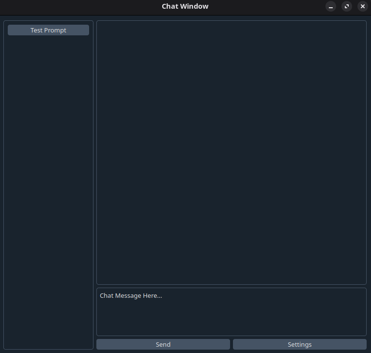

# ChatGPTGUI
**I'll come up with a better name later**

Currently a simple ChatGPT interface, requires an API key but hopefully will not in the future

## Dependencies
`pip install revchatgpt pyqt5 qdarkstyle`
There might be more but I can't remember

## Running
`git clone https://github.com/gsaker/ChatGPTGUI/`

`cd ChatGPTGUI`

`python main.py`

It's that simple

Should be OS agnostic but not tested on anything other than Linux
